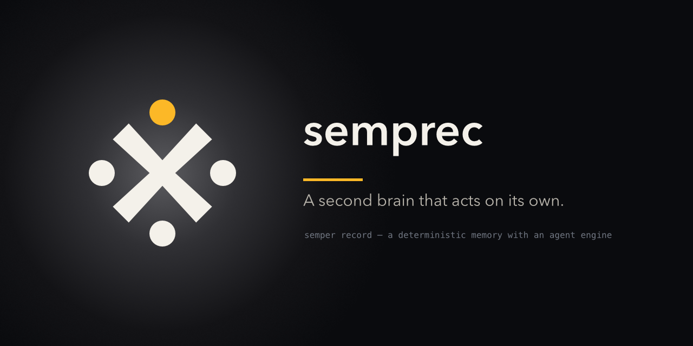

# Semprec

Semprec is a personal life-organization system: a Postgres-backed data layer
with a generic API choke-point, Yjs CRDT blocks/canvas, an IMAP-driven inbox
pipeline, and an AI agent runtime (`pi-agent-core`) that acts through defined,
structured mechanisms instead of freeform notes. The goal is determinism
everywhere it matters — heartbeats bound to concrete events and databases,
schema changes only through code, agent actions inspectable and triggerable
via API/MCP rather than a silent background cron — as the explicit
alternative to the "tell the AI to do a lot and hope it works out" model of
tools like OpenClaw or Hermes.

This repo holds the implementation. The design and planning live separately,
in the `vize/` prototype of the `LifeOS` repo (local-only, no remote);
`backend.html` there is the full specification this implementation is built
from.

## Scope

This repo is a monorepo for the whole product, not just the backend:

- `backend/` — a pnpm workspace for the API, agent runtime, sync services,
  and shared packages. This is where all current implementation work lives.
- `apple/` — a single shared Swift codebase for the iOS and macOS app (one
  app, both platforms — not two separate projects). Scaffold only for now.
- `web/` — the web frontend. Scaffold only for now.

## Where work comes from

This repo does **not** follow `backend.html` directly. Each unit of work has
its own fully self-contained GitHub Issue — context, task, and scope are
written directly in the issue, with no need to open the planning repo.
Issues within a batch form a dependency DAG rather than a strict chain
(`.github/ISSUE_FORMAT.md`): an issue is worked only after the issues it is
actually `Blocked by:` are merged, but issues with no dependency between them
may be worked in parallel.

## Structure

- `backend/packages/` — shared core: `data`, `module-registry`,
  `agent-runtime`, `queue`, `realtime`, `credentials`, `shared`.
- `backend/modules/` — vertical slices (Emails, Semprec, later Books/Films) —
  created incrementally as the issue queue progresses.
- `backend/services/` — standalone processes (`semprec-api`,
  `semprec-agents`, `semprec-mailsync`, `semprec-transcribe`,
  `semprec-ai-gateway`) — created incrementally as the issue queue progresses.
- `apple/` — empty until the issue queue reaches it; `web/` is a React +
  TypeScript (Vite) app, currently holding the view registry, the generic
  operations client, and the mailbox view renderer.
- `deploy/` — host-level operational configuration (Caddy, firewall, the
  database/object-storage compose file) for the single-server production
  deployment — see [`deploy/README.md`](deploy/README.md).

## Stack

Backend: Node LTS, TypeScript, pnpm workspace, Postgres (+ Prisma),
`graphile-worker`. Web frontend: React + TypeScript on Vite, tested with
Vitest. Apple app: stack to be decided when its first issue lands.

## Branching and releases

`develop` is the integration branch — all feature/issue work targets it via
PR, gated by an automated code review. `main` holds released versions only:
it advances exclusively through a `develop -> main` promotion PR. A release
is a single monorepo `vMAJOR.MINOR.PATCH` tag, created only by the guarded
command in `backend/packages/release` on a green `main` commit — merging the
promotion PR does not tag anything by itself (see
[`docs/operations/releases.md`](docs/operations/releases.md)). Both branches are protected; the
checks a pull request must pass are listed in
[`docs/operations/required-checks.md`](docs/operations/required-checks.md).

## Architecture decisions

Why the architecture is shaped the way it is — the choke-point API, the
ownership model, the AI gateway, migration discipline, and other
cross-cutting calls — is recorded as Architecture Decision Records under
[`docs/adr/`](docs/adr/README.md). Check there before introducing a new
architectural pattern.
